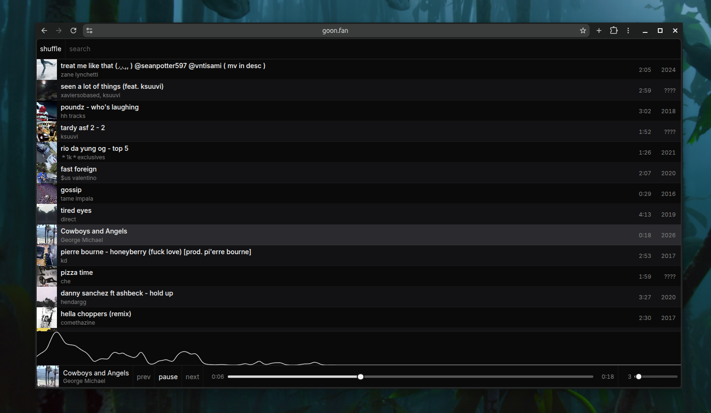

# player

a minimal web player for a [navidrome](https://www.navidrome.org/) music library.

<p align="center">
  
</p>

**minimal by design**
>
> player focuses on browsing and playing individual tracks. albums, playlists, lyrics, queues, and broader library management are not supported.
>
**deployment notice**
>
> anyone who can reach a deployed instance can browse and stream the configured navidrome library. place the app behind access control or use a dedicated navidrome account unless public access is intentional.

## deploying your own instance

vercel is highly recommended for deployment and handles the next.js build automatically.

[](https://vercel.com/new/clone?repository-url=https%3A%2F%2Fgithub.com%2Fneko%2Fplayer&env=NAVIDROME_URL%2CNAVIDROME_USER%2CNAVIDROME_PASSWORD&envDescription=Enter%20the%20URL%20and%20credentials%20for%20your%20Navidrome%20server.&project-name=player&repository-name=player)

add these environment variables to the vercel project:

```dotenv
NAVIDROME_URL=https://music.example.com
NAVIDROME_USER=your_username
NAVIDROME_PASSWORD=your_password
```

navidrome credentials are used only by the server and must never be exposed through `NEXT_PUBLIC_` variables.

## running locally

create `.env.local`:

```dotenv
NAVIDROME_URL=https://music.example.com
NAVIDROME_USER=your_username
NAVIDROME_PASSWORD=your_password
```

install deps & run:

```sh
bun i && bun run dev
```

then open [http://localhost:3000](http://localhost:3000).

## keyboard controls

| key | action |
| --- | --- |
| `space` | play or pause |
| `arrow left` | restart the current track, or play the previous track near its beginning |
| `arrow right` | play the next track |
| `arrow left` / `arrow right` on the timeline | seek by five seconds |
| `home` / `end` on the timeline | seek to the beginning or end |

## contributing

contributions should preserve the default minimal experience. fixes and optimizations may improve existing behavior; additional functionality, including albums, playlists, lyrics, queues, and library management, must remain opt-in.
